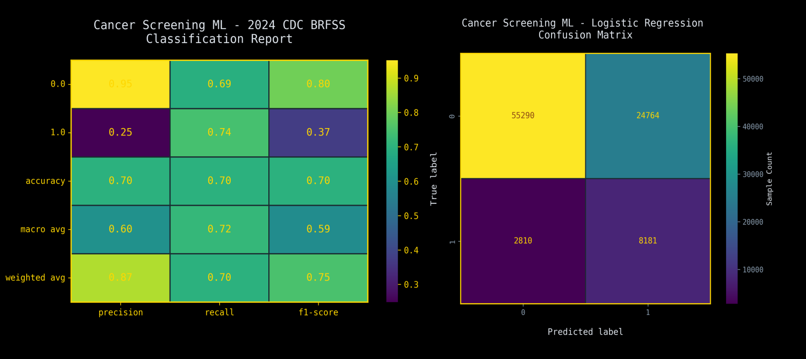
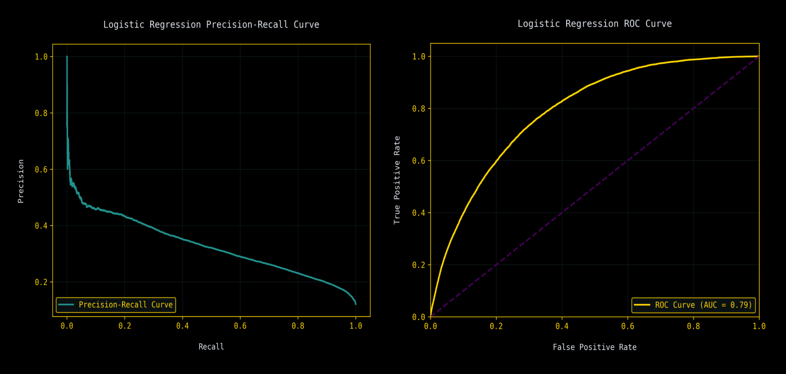

<div align="center">
  
</div>

  
  
  <p><b>Developed by the students of Kocaeli, Manisa Celal Bayar and Hitit universities.</b></p>
</div>

<p align="center">
  
  
  
  
</p>

---

## About the Project

This project is a machine learning research developed to optimize cancer screening, risk factor detection, and early diagnosis processes. By analyzing patients demographic information, lifestyle habits, and general health status, we predict whether individuals carry a risk of cancer or whether they will adhere to cancer screening programs.
Brought to life as an interdisciplinary academic study through the knowledge and collaboration of three different universities, this project aims to provide a data-driven decision support mechanism for preventive medicine policies.

[Turkish Documentation](https://github.com/yunhanref/cancer-screening-ml-project/blob/main/docs/TR_README.md)

## 👤 My Role & Contributions

In this collaborative multi-university project, I served as the **Project Group Leader** and **Machine Learning Developer**. My primary focus was establishing the project infrastructure, preparing the foundational data, and developing the core predictive classification models.

Here are my specific technical contributions to the Cancer Screening ML Project:

* **Project Leadership:**
    * Architected the GitHub repository structure, establishing the version control workflow and maintaining branch policies for the team.
    * Coordinated task delegation and code reviews among student team members from Manisa Celal Bayar, Kocaeli, and Hitit Universities.
* **Data Preprocessing & Feature Engineering:**
    * Conducted exploratory **Codebook analysis** for feature selection, isolating critical clinical variables based on statistical relevance.
    * Executed data cleaning pipelines to resolve missing values, handle outliers, and format the raw dataset for model ingestion.
    * Implemented a stratified train/test data split to ensure unbiased evaluation, integrating my workflow with the data engineering team's pipeline.
* **Machine Learning Model Development (Logistic Regression):**
    * Developed and fine-tuned a Logistic Regression classifier, one of the three primary predictive models evaluated in this study.
    * Configured model hyperparameters and threshold values to optimize for clinical detection contexts.

## 👤 My Models Performance
<div align="center">
  
  
</div>  

## Data Set: 2024 CDC BRFSS

In our study, the **CDC (Centers for Disease Control and Prevention)** published [2024 BRFSS (Behavioral Risk Factor Surveillance System)](https://www.cdc.gov/brfss/index.html) dataset was used. 

* **Content:** According to the cancer research topic of the 7th group, the dataset, which has been cleaned from start to finish, generally contains many cancer types, smoking/alcohol consumption, physical activity, chronic disease history, and sociodemographic survey responses.
* **Data Size:** Since both the processed and original datasets are quite large in volume, they are not hosted on the GitHub repository but on our group's Google Drive address (See *data/drive.txt*).

## Methodology

To produce meaningful results from tabular survey data, the following data science pipeline was followed:

1.  **Data Preparation:**  CDC BRFSS 2024 veri setinin [Codebook'u](https://www.cdc.gov/brfss/annual_data/2024/zip/codebook24_llcp-v2-508.zip), veri mimarlarınca detaylıca incelenmiş olup, proje konusu kapsamında ana ve bağımsız değişkenler üzerinde tartışılmıştır.
<div align="center">
  
  <p><small>img 1.0 - Main Variable CHCOCNC1</small></p>
  
  <p><small>img 2.0 - Independent Variable Example SMOKE100</small></p>
</div> 

2. **Data Preprocessing:**
   * **Determining the main variable:** For the selection of variables directed at cancer screening, which is our topic, we concluded that "CHCOCNC1" is the variable that addresses a broad audience and where potential side variables could show the highest correlation.
   * **Feature Engineering:** Selecting demographic and behavioral features (e.g., `_AGEG5YR`, `SMOKE100`, `CHCSCNCR`) that show the highest correlation with general cancer diagnosis.
   * **Selected Main and Dependent Variables:**
   ```
   Main Variable:
   CHCOCNC1: Have you ever been told you had melanoma or any other skin cancer? (30 categories)

   Independent Variables:
   CHCSCNC1: Have you ever been told you had skin cancer or melanoma?
   CHECKUP1: About how long has it been since you last visited a doctor for a routine checkup?
   _AGEG5YR: How old are you? (14 categories)
   SMOKE100: Have you smoked at least 100 cigarettes in your entire life?
   DIABETE4: Have you ever been told you have diabetes?
   EXERANY2: During the past month, other than your regular job, did you participate in any physical activities or exercises?
   ASTHMA3:  Have you ever been told you had asthma?
   CHCKDNY2: Have you ever been told you had kidney disease, excluding kidney stones, bladder infections, or incontinence?
   HAVARTH4: Have you ever been told you have some form of arthritis, rheumatoid arthritis, gout, lupus, or fibromyalgia?
   CVDINFR4: Have you ever been told you had a heart attack (myocardial infarction)?
   PERSDOC3: Do you have one or more persons you think of as your personal doctor or health care provider?
   _RFHLTH:  Health status question
   INCOME3:  What is your annual household income from all sources? (11 categories)
   EDUCA:    What is the highest grade or year of school you completed?
   _BMI5CAT: What is your Body Mass Index? (4 categories of BMI)
   ```
   
3. **Data Reading and Transformation:**
   * Handling "Don't know/Refused" responses (see figure 1.0, values 7 and 9) specific to BRFSS as missing data (NaN).
   * Remapping variable values with binary responses as 1s and 0s for learning performance.
   * Determining the target variable (cancer diagnosis / screening status) and addressing class imbalances (Cost-Sensitive Learning).
4. **Modeling:** Training the models built using Logistic Regression, Bayesian Approach, and Artificial Neural Networks, which show high performance on tabular data.
5. **Evaluation:** Models were statistically measured and compared against each other using Accuracy, Precision, Recall, F1-Score, and ROC-AUC metrics.
---

## Architecture
```
cancer-screening-ml-project/
│
├── data/               # CDC BRFSS raw and cleaned (.csv) datasets
├── notebooks/          # Exploratory Data Analysis (EDA) and prototype modeling Jupyter
├── src/                # Model pipeline, data preprocessing, training, and prediction Python scripts
├── docs/               # Research report, project guidelines, CDC Codebook
├── variables_codebook/ # Screenshot survey data taken from the Codebook by data architects
├── .gitignore          # Files to be excluded from Git tracking (large and unnecessary files)
├── .gitkeep            # Command to maintain empty folder structures
├── README.md           # Project introduction
├── requirements.txt    # Required libraries for Python scripts
└── extras              # Extra information about the project
```
---
## Installation and Usage
1. **Clone the Repo and Install Libraries:**
  ```
  git clone https://github.com/yunhanref/cancer-screening-ml-project.git
  cd cancer-screening-ml-project
  pip install -r requirements.txt
  ```
2. **Add the Dataset:**
  Due to file size limitations, the dataset is not available on GitHub. Download the X_train, X_test, y_train, and y_test files from the link inside data/drive.txt and place them into the data/ folder.
  
3. **Modelleri Çalıştırın:**
  Modelleri baştan eğitmek için src/ klasöründeki betikleri kullanabilirsiniz:
  ```
  python src/logistic_regression.py
  python src/naive_bayes.py
  python src/ann_model_training.py
  (Note: You can examine the Jupyter files in the notebooks/ folder to see ready-to-view results and graphs.)
  ```


<div align="center">
  
</div>  
